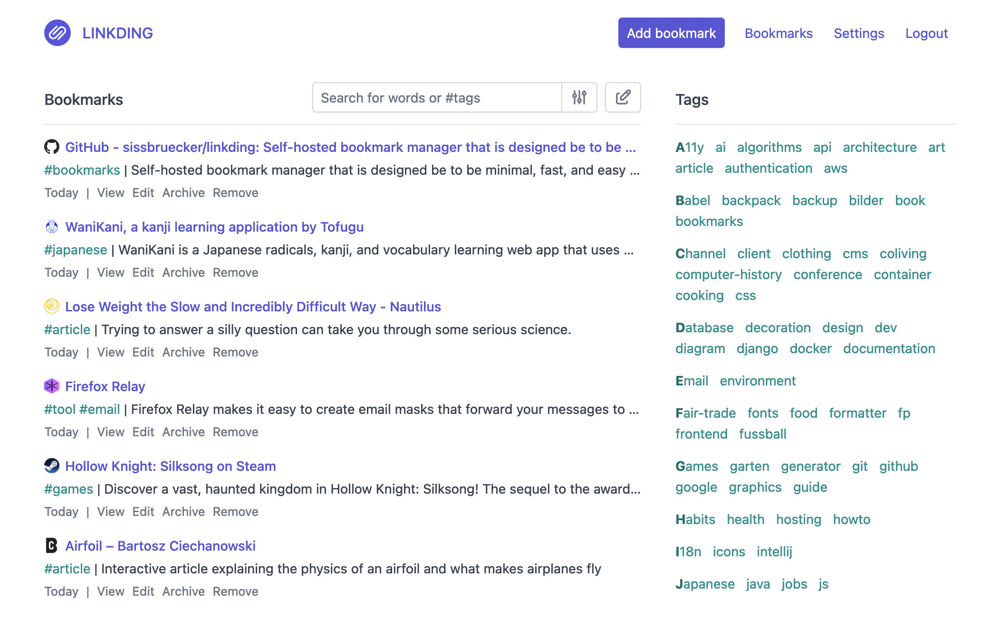

linkding is a bookmark manager that you can host yourself.
It's designed be to be minimal, fast, and easy to set up using Docker.

The name comes from:
- *link* which is often used as a synonym for URLs and bookmarks in common language
- *Ding* which is German for thing
- ...so basically something for managing your links

**Feature Overview:**
- Clean UI optimized for readability
- Organize bookmarks with tags
- Bulk editing, Markdown notes, read it later functionality
- Share bookmarks with other users or guests
- Automatically provides titles, descriptions and icons of bookmarked websites
- Automatically archive websites, either as local HTML file or on Internet Archive
- Import and export bookmarks in Netscape HTML format
- Installable as a Progressive Web App (PWA)
- Extensions for [Firefox](https://addons.mozilla.org/firefox/addon/linkding-extension/) and [Chrome](https://chrome.google.com/webstore/detail/linkding-extension/beakmhbijpdhipnjhnclmhgjlddhidpe), as well as a bookmarklet
- SSO support via OIDC or authentication proxies
- REST API for developing 3rd party apps
- Admin panel for user self-service and raw data access

**Demo:** https://demo.linkding.link/

**Screenshot:**

